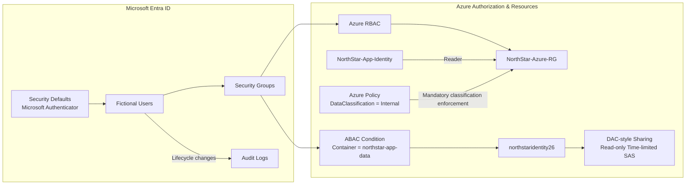

# NorthStar Identity & Zero Trust Architecture

This project demonstrates an enterprise identity and access model using Microsoft Entra ID and Azure security controls.

## Architecture

## Access Control Model

- **RBAC** — Group-based Azure role assignments with least-privilege scope.
- **ABAC** — Storage access restricted with a condition based on the target container name.
- **DAC-style** — Discretionary object sharing demonstrated with a read-only, time-limited SAS.
- **MAC-style** — Centralized mandatory classification demonstrated through Azure Policy enforcement.

## Zero Trust Controls

- Security Defaults enabled in Microsoft Entra ID.
- Microsoft Authenticator enabled for all users.
- Group-based authorization instead of direct user role assignments.
- Managed identity used for non-human Azure authorization without storing user credentials.
- Audit logging used to verify identity lifecycle changes.
