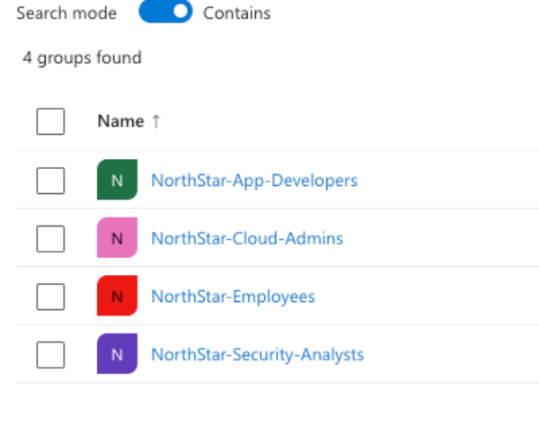
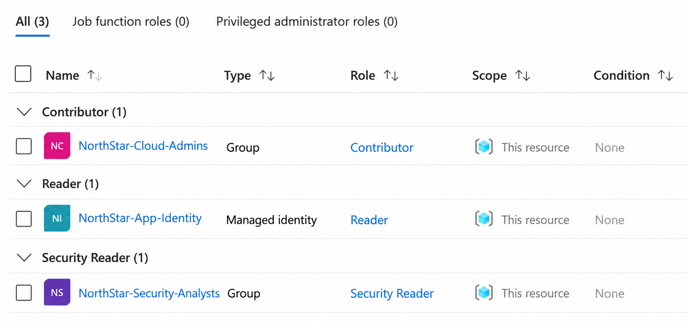
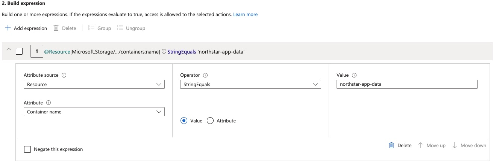
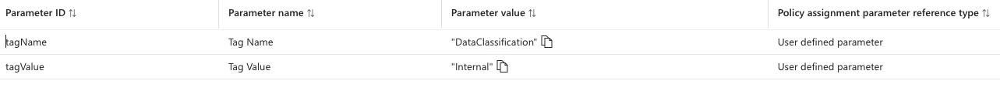
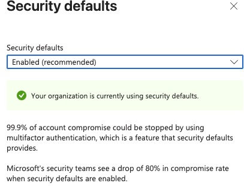
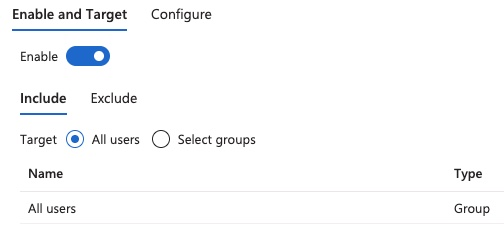

# NorthStar Identity & Zero Trust — Evidence Guide

This directory documents the hands-on evidence produced during the project.

Evidence is intentionally sanitized before publication to prevent exposure of tenant identifiers, subscription identifiers, object IDs, principal IDs, authentication tokens, or other sensitive information.

## Identity Foundation

Evidence captured during the lab includes:

- Microsoft Entra fictional user accounts
- NorthStar security groups
- User-to-group membership
- Role-oriented identity design

### Personas

| Persona | Function | Access Model |
|---|---|---|
| Alex Morgan | Standard Employee | Baseline organizational access / DAC scenario |
| Jamie Chen | Application Developer | Application data access / ABAC scenario |
| Taylor Brooks | Security Analyst | Security monitoring / RBAC |
| Jordan Lee | Cloud Administrator | Azure administration / RBAC |

## Azure RBAC

Verified role assignments include:

| Principal | Role | Scope |
|---|---|---|
| NorthStar-Cloud-Admins | Contributor | NorthStar-Azure-RG |
| NorthStar-Security-Analysts | Security Reader | NorthStar-Azure-RG |
| NorthStar-App-Developers | Storage Blob Data Contributor | northstaridentity26 |
| NorthStar-App-Identity | Reader | NorthStar-Azure-RG |

These assignments demonstrate group-based authorization, workload identity authorization, scoped access, and least-privilege design.

## ABAC

Azure attribute-based access control was demonstrated by adding a condition to the `NorthStar-App-Developers` storage role assignment.

The condition restricts selected blob operations based on the resource attribute:

`Container name = northstar-app-data`

This demonstrates Azure ABAC layered on an Azure RBAC role assignment.

## DAC-Style Resource Sharing

A discretionary sharing scenario was demonstrated using the blob:

`employee-access-demo.txt`

A SAS was generated with:

- Read-only permission
- HTTPS-only access
- Limited expiration
- Access to a specific storage object

The SAS token and SAS URL are intentionally excluded from this repository.

## MAC-Style Centralized Enforcement

Azure Policy was used to require:

`DataClassification=Internal`

A non-compliant resource update was intentionally attempted and denied by policy.

After the required classification tag was added, the operation succeeded.

This demonstrates centrally imposed mandatory classification enforcement.

## Zero Trust Authentication

Evidence includes:

- Microsoft Entra Security Defaults enabled
- Microsoft Authenticator enabled for all users

Conditional Access was not represented as deployed because the project used a Microsoft Entra Free environment.

## Managed Identity

The user-assigned managed identity:

`NorthStar-App-Identity`

was created and assigned:

`Reader → NorthStar-Azure-RG`

PowerShell was used to verify the identity and its Azure role assignment.

## Identity Governance

A manual leaver scenario was performed for the fictional employee Alex Morgan.

The account was retained while membership in:

`NorthStar-Employees`

was removed.

This demonstrates access revocation without immediately deleting the identity.

## Audit Evidence

Microsoft Entra audit logs recorded the lifecycle operation:

`Remove member → Success`

An attempt to access sign-in logs returned a 401 insufficient-privileges response. The limitation is documented rather than represented as successful sign-in-log analysis.

## Automation Evidence

The repository includes:

- Azure CLI automation for managed identity and RBAC configuration
- PowerShell automation for identity and RBAC inventory

## Evidence Sanitization Requirements

Before publishing screenshots or command output, remove or obscure:

- Subscription IDs
- Tenant IDs
- Object IDs
- Principal IDs
- Client IDs
- Personal user principal names
- SAS tokens
- SAS URLs
- Session IDs
- Portal URLs containing embedded identifiers
- Authentication information

No credentials, secrets, or reusable authentication tokens should be committed to this repository.
---

# Visual Evidence

The following sanitized screenshots provide direct evidence of the controls implemented during the NorthStar Identity & Zero Trust project.

Sensitive identifiers, credentials, tokens, and personal account information are intentionally excluded.

## 1. Microsoft Entra Security Groups

Four role-oriented security groups were created to support group-based authorization and identity lifecycle management.

**Demonstrates:** Microsoft Entra group administration, role-oriented access design, and group-based identity management.

---

## 2. Azure RBAC Role Assignments

Azure RBAC assignments demonstrate least-privilege authorization for administrative, security, and workload identities.

**Demonstrates:** Azure RBAC, group-based authorization, managed identity authorization, role separation, and resource-group scoped access.

---

## 3. Azure ABAC Container Condition

An Azure ABAC condition restricts selected blob operations using the target resource's container name.

**Condition:**

`Container name StringEquals northstar-app-data`

**Demonstrates:** Attribute-based authorization layered onto Azure RBAC.

---

## 4. Azure Policy — Mandatory Data Classification

Azure Policy requires NorthStar resources to carry the centrally defined classification:

`DataClassification=Internal`

**Demonstrates:** Centralized governance and MAC-style mandatory classification enforcement.

---

## 5. Microsoft Entra Security Defaults

Security Defaults are enabled in the Microsoft Entra tenant.

**Demonstrates:** Baseline tenant-level identity protection and Zero Trust-aligned authentication controls.

---

## 6. Microsoft Authenticator

Microsoft Authenticator is enabled and targeted to all users in the lab tenant.

**Demonstrates:** Organization-wide authentication-method configuration supporting stronger user authentication.

---

## Evidence Integrity

The screenshots are provided as implementation evidence rather than decorative documentation. Together with the automation scripts and troubleshooting records, they demonstrate that the documented controls were configured and validated in the Azure and Microsoft Entra environment.

Where functionality could not be implemented or reproduced because of licensing or access constraints, the limitation is explicitly documented rather than represented as deployed.
